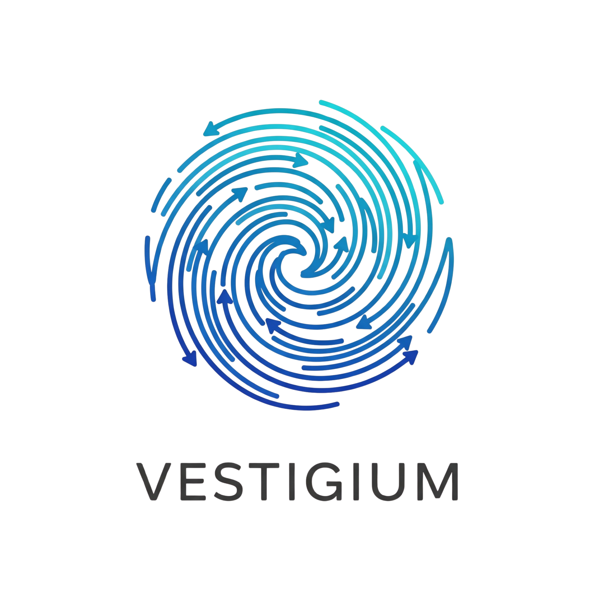

# Vestigium 🫆🌳

[](https://pre-commit.com/)
[](https://github.com/MarinCervinschi/Vestigium/actions/workflows/ci.yml)
[](https://codecov.io/gh/MarinCervinschi/Vestigium)
[](https://www.python.org/downloads/)

<p align="center">
    
</p>

A simple Version Control System (VCS) built in Python for educational purposes. I created this project to understand and replicate the core local mechanisms of Git.

## About This Project

Vestigium is my educational implementation that focuses on **Git's local operations** - the fundamental building blocks that make version control possible. By recreating Git's internal mechanisms from scratch, I'm learning to understand:

- How Git stores objects (blobs, trees, commits, tags) using SHA-1 hashing
- The structure and purpose of the `.git` directory (I call it `.ves` here)
- How the index (staging area) works internally
- Reference management (branches, tags, HEAD)
- Object compression and storage strategies
- The relationship between working tree, index, and repository

**My Goal**: Demystify Git's "magic" by building a compatible implementation that reveals the elegant simplicity behind version control.

## 📚 Technical Documentation

For a deep dive into Git's internal concepts and how they're implemented in Vestigium, check out the **comprehensive technical documentation**:

**📖 [Complete Documentation Guide](docs/README.md)**

This documentation covers:
- **Core Concepts**: Repository structure, object system, staging area, references
- **Essential Operations**: Tree operations, file filtering, status computation  
- **Supporting Systems**: Configuration, text parsing, utility infrastructure
- **Practical Usage**: Complete command reference with examples

The docs explain **why Git works the way it does** rather than just how to use it - perfect for understanding the fundamental concepts that make version control possible.

## Repository Overview

This is how I've organized my codebase to mirror Git's internal structure:

```
src/
├── cli.py              # Argument parsing controller
├── libves.py           # Main entry point
├── commands/           # Individual command implementations
│   ├── init.py         # Repository initialization
│   ├── add.py          # Staging area management
│   ├── commit.py       # Creating commits
│   ├── status.py       # Working tree status
│   └── ...             # Other Git-like commands
├── core/               # Core Git mechanisms
│   ├── repository.py   # Repository structure and management
│   ├── objects.py      # Object storage (blob, tree, commit, tag)
│   ├── index.py        # Staging area implementation
│   └── refs.py         # Reference management
└── utils/              # Helper modules
    ├── tree.py         # Tree traversal and manipulation
    ├── status.py       # Status comparison algorithms
    └── config.py       # Configuration handling
```

## Features

- **Educational focus**: I've written clean, readable code with extensive comments to document my learning journey
- **Git compatibility**: I use the same object formats and hashing as Git
- **Modular architecture**: I've separated CLI, core logic, and command implementations
- **Comprehensive testing**: I've built a full test suite covering all major functionality
- **Docker support**: I've set up an isolated testing environment with Docker Compose
- **CI/CD**: I've automated testing with GitHub Actions

## Installation

### Local Development

1. Clone the repository:

```bash
git clone https://github.com/MarinCervinschi/Vestigium.git
cd Vestigium
```

2. Install in development mode with dependencies:

```bash
pip install -e ".[dev]"
```

3. Make the executable script runnable:

```bash
chmod +x ./ves
```

### Docker Development

For a clean, isolated environment:

```bash
# Run tests
docker compose run --rm vestigium-test

# Start development environment
docker compose run --rm vestigium-dev
```

## Usage

### Available Commands

For detailed usage and examples of all commands, see [COMMANDS.md](docs/COMMANDS.md).

**Basic Commands:**

- `init` - Initialize a new repository
- `add` - Add files to staging area
- `commit` - Record changes to repository
- `status` - Show working tree status
- `checkout` - Extract commit to directory

**Object Management:**

- `hash-object` - Calculate and store file hash
- `cat-file` - Display object content

**Navigation & History:**

- `log` - Show commit history
- `ls-files` - List files in index
- `ls-tree` - List tree contents

**References & Tags:**

- `tag` - Create and list tags
- `show-ref` - Show all references
- `rev-parse` - Resolve identifiers

**Utilities:**

- `rm` - Remove files from index
- `check-ignore` - Verify ignore rules

## Development

### Code Quality Tools

This project uses several tools to maintain code quality:

```bash
# Format code with Black
black src/ tests/

# Sort imports with isort
isort src/ tests/

# Type checking with MyPy
mypy src/

# Run all quality checks
black src/ tests/ && isort src/ tests/ && mypy src/
```

### Testing

#### Docker Testing (Recommended)

```bash
# Run tests in clean Docker environment
docker compose run --rm vestigium-test

# Development environment with all tools available
docker compose run --rm vestigium-dev
```

#### Local Testing

```bash
# Run tests locally
pytest tests/ -v

# Run tests with coverage
pytest --cov=src --cov-report=term-missing

# Generate HTML coverage report
pytest --cov=src --cov-report=html
```

## License

This project is licensed under the MIT License - see the [LICENSE](LICENSE) file for details.
